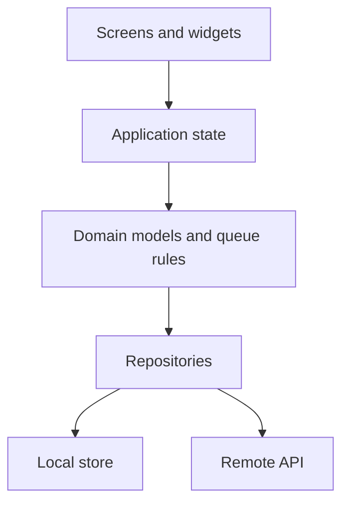

# BranchQ — Phase-wise Architecture

BranchQ is a queue app for a service branch (bank counter, clinic, government desk, or salon). A customer picks a branch and a service, receives a token, and watches their place in line. Staff at a counter call the next token and mark it served, skipped, or cancelled.

This document is the build plan for a first Flutter app. Each phase adds one layer of the architecture. Finish a phase and check its exit criteria before starting the next one.

Working assumption: one organization, many branches, each branch has services and counters. Customers and staff are the two roles in the first release. A branch manager view comes later.

## Target shape

The finished app has four layers. Early phases keep these layers in fewer files. Later phases split them apart without changing the screens.

```text
Presentation   screens, widgets, theme, navigation
Application    state that screens read and update
Domain         models and the rules of a queue
Data           repositories that load and save those models
```



A screen never talks to storage or the network directly. It asks application state to do something (`joinQueue`, `callNext`). Application state uses domain rules, then asks a repository to save the result.

## Technology choices

| Concern | Choice | Why it fits a first app |
| --- | --- | --- |
| UI | Flutter, Material 3 | Built in. One design system for every screen. |
| Language | Dart | The language Flutter uses. |
| Navigation | `go_router` | Named routes and a clear map of screens. |
| State | `provider` + `ChangeNotifier` | Small API. Enough for this app. |
| Models | Plain Dart classes | No code generation until the models settle. |
| Local data | `shared_preferences`, then `sqflite` if the queue history grows | Start with a simple store. Move to a database only when lists need queries. |
| Remote data | REST API behind the same repository interface | Screens stay the same when the fake repository is replaced. |
| Auth | Session token in local storage, `go_router` redirects | The same guard covers a local sign-in now and the API later. |
| Tests | `flutter_test` | One test per phase once behavior exists. |

Add a package only in the phase that needs it.

## Product model

```text
Organization
  └── Branch
        ├── Service        (Cash, Account opening, Consultation)
        ├── Counter        (Counter 1, Counter 2)
        └── Token
              status: waiting | called | serving | served | skipped | cancelled
```

| Model | Owns |
| --- | --- |
| `Branch` | id, name, address, open/closed |
| `Service` | id, branchId, name, average service minutes |
| `Counter` | id, branchId, name, active service, open/closed |
| `Token` | id, display number, branchId, serviceId, status, createdAt |
| `StaffSession` | staff name, branchId, counterId |
| `User` | id, name, email, role (`customer` or `staff`) |
| `Session` | userId, role, branchId, token, expiresAt |

Queue rules live in one place, `QueueRules`, not inside widgets:

- A new token gets the next display number for that branch and service today.
- Only a `waiting` token can be called.
- Calling a token sets it to `called` and attaches the counter.
- A counter serves one token at a time.
- Estimated wait is `people ahead × average service minutes`.

Who someone is, and what they may do, live in `AccessPolicy`:

- A guest may join a queue and read the token id stored on this device.
- A signed-in customer may read only their own tokens.
- A staff member may call, serve, and skip only at their own branch.
- `/staff` and `/staff/counter` open only for a staff session that has not expired.

## Navigation

```text
/                         Splash
/role                     Customer or Staff
/sign-in                  Email and password
/branches                 Branch list
/branches/:id/services    Service list
/tokens/:id               Customer token and position
/staff                    Staff home for the signed-in branch
/staff/counter            Call next, serve, skip
```

Customer path: Role → Branch → Service → Token. A returning customer may sign in first.
Staff path: Role → Sign in → Staff home → Counter.

## Folder layout at the end of Phase 6

```text
lib/
  main.dart
  app.dart
  core/
    theme/app_theme.dart
    router/app_router.dart
  features/
    branch/
    queue/
    staff/
      presentation/       screens and widgets
      application/        ChangeNotifier
      domain/             models and QueueRules
      data/               repository implementations
docs/
  phasewise-architecture.md
```

Phases 1–3 may keep models and screens under `lib/features/<feature>/` without the four subfolders. Phase 6 is when the split becomes mandatory.

---

## Phase 1 — Project shell

**Goal:** a Flutter app that opens, uses one theme, and can move between empty screens.

**Learn:** `flutter create`, widgets, `MaterialApp`, `ThemeData`, routes.

**Build:**

- Create the Flutter project in this folder.
- `lib/app.dart` holds `MaterialApp.router`.
- `lib/core/theme/app_theme.dart` sets colors, type, and component themes.
- `lib/core/router/app_router.dart` registers `/` and `/role`.
- Splash shows the BranchQ name. Role screen shows Customer and Staff buttons that do not navigate yet.

**Exit:** `flutter run` shows Splash, then Role, on a phone or emulator. Theme changes in `app_theme.dart` show up on both screens.

## Phase 2 — Static screens

**Goal:** every screen in the navigation map, filled with fixed sample data written in the widget.

**Learn:** layout (`Column`, `ListView`, `Card`), passing constructor arguments, extracting widgets.

**Build:**

| Screen | Shows |
| --- | --- |
| Branch list | three sample branches |
| Service list | services for the tapped branch |
| Token | token `A012`, 4 people ahead, about 16 minutes |
| Staff home | branch name and open counters |
| Counter | current token and buttons: Call next, Served, Skip |

Buttons may still change nothing. Navigation must work along both paths.

**Exit:** you can tap from Role to Token, and from Role to Counter, using only sample data.

## Phase 3 — Models and an in-memory queue

**Goal:** screens read Dart models. Joining a queue and calling the next token change real objects in memory.

**Learn:** classes, enums, lists, a repository interface, constructor injection.

**Build:**

- `TokenStatus` enum and the five models in the product model table.
- `QueueRules` with the five rules above.
- `QueueRepository` interface: `listBranches`, `listServices`, `joinQueue`, `watchToken`, `callNext`, `markServed`, `skip`.
- `InMemoryQueueRepository` seeded with the Phase 2 sample branches. Data lives in fields on the class and disappears when the app restarts. That is expected.
- Screens take models instead of hardcoded strings.

**Exit:** two customers can join the same service and receive `A001` and `A002`. Staff can call `A001`, mark it served, and call `A002`. Restarting the app restores the seed data.

## Phase 4 — Shared application state

**Goal:** any screen sees the same queue, and the token screen updates when staff call a number.

**Learn:** `ChangeNotifier`, `notifyListeners`, `provider`, `context.watch` and `context.read`.

**Build:**

- `QueueController extends ChangeNotifier` holds the repository and exposes the methods screens need.
- `main.dart` provides one `QueueController` above `BranchQApp`.
- Token screen watches its token. Counter screen watches the active token and the waiting list.
- Replace direct repository calls inside widgets with controller methods.

**Exit:** with two running views, or by navigating away and back, a customer token moves from waiting to called when staff tap Call next. No screen keeps its own copy of the token list.

## Phase 5 — Local persistence

**Goal:** the queue survives an app restart on this device.

**Learn:** `shared_preferences` or `sqflite`, async loading, a loading state on the controller.

**Build:**

- `LocalQueueRepository implements QueueRepository`.
- Save branches, services, counters, and tokens as JSON (preferences) or rows (sqflite).
- On startup the controller loads storage before the first screen reads the queue. Show a loading indicator on Splash while that happens.
- Keep `InMemoryQueueRepository` for tests.

Use `sqflite` when you need “today’s tokens” or history queries. Preferences are enough for a single branch demo.

**Exit:** join a queue, stop the app, open it again, and the same token is still waiting. Served tokens stay served.

## Phase 6 — Feature layers

**Goal:** the folder layout matches the target shape, feature by feature.

**Learn:** feature folders, depending inward (presentation → application → domain ← data).

**Build:**

- Move branch, queue, and staff code into `presentation`, `application`, `domain`, and `data`.
- Domain files import nothing from Flutter, Provider, or storage.
- Widgets import the controller, not the repository.
- Add widget tests for Branch list and Counter, and unit tests for `QueueRules` (next number, cannot call a served token, estimate).

**Exit:** `flutter test` passes. A search of `presentation/` finds no `shared_preferences`, `sqflite`, or HTTP imports.

## Phase 7 — Roles

**Goal:** Customer and Staff are real sessions, not a button that anyone can tap through.

**Learn:** a small auth state, route guards in `go_router`.

**Build:**

- Customer continues without an account: they only hold a token id on the device.
- Staff enters a branch code and a display name. `StaffSession` is stored locally.
- `/staff` and `/staff/counter` redirect to `/role` when there is no staff session.
- Staff can close the counter, which returns the called token to `waiting` if it was not served.

**Exit:** a cold start as a customer never opens the counter screen. A staff session still exists after restart until they sign out.

## Phase 8 — Authentication and authorization

**Goal:** sign-in proves who the person is. `AccessPolicy` decides which screens and queue actions that role may use.

**Learn:** a sign-in form, a session token, role checks, replacing the Phase 7 branch-code shortcut.

**Build:**

- `features/auth/` uses the same four layers as Phase 6.
- `AuthRepository` interface: `signIn`, `signOut`, `currentSession`.
- `InMemoryAuthRepository` seeded with one customer and one staff user at Central Branch. Passwords stay inside that repository. The device stores only the session token.
- `Session` replaces `StaffSession`. It records the user, the role, the staff branch, the token, and when it expires.
- Sign-in screen at `/sign-in` asks for email and password. A failed sign-in stays on that screen.
- Customer on the role screen can continue as a guest or open sign-in. Staff on the role screen opens sign-in before `/staff`.
- `AccessPolicy` allows or refuses `joinQueue`, `watchToken`, `callNext`, `markServed`, and `skip` before the queue repository runs.
- Sign out clears the session. The next visit to `/staff` returns to `/sign-in`.

**Exit:** a wrong password never opens the counter. A signed-in staff member at Central Branch can call the next token there. A customer session cannot open `/staff/counter`. After restart, a session that has not expired is still signed in.

## Phase 9 — Remote queue

**Goal:** two phones share one queue: a customer’s phone and a counter tablet.

**Learn:** a second repository implementation, async errors, pulling or listening for changes.

**Build:**

- `RemoteQueueRepository implements QueueRepository` and `RemoteAuthRepository implements AuthRepository` against an HTTP API.
- The controller depends on `QueueRepository`, so screens stay as they are.
- Surface loading and error on join, call next, and token refresh.
- Poll the token every few seconds, or subscribe if the API supports it.
- The API owns token numbers. The device does not invent `A012` anymore.
- Staff requests send `Authorization: Bearer <token>`. A missing or expired token, or a customer token on a staff action, returns an authorization failure and the app shows it.

Suggested endpoints:

| Action | Request |
| --- | --- |
| Sign in | `POST /sign-in` with email and password |
| Sign out | `POST /sign-out` |
| List branches | `GET /branches` |
| List services | `GET /branches/{id}/services` |
| Join | `POST /queues` with branchId and serviceId |
| Read token | `GET /tokens/{id}` |
| Call next | `POST /counters/{id}/call-next` |
| Served / skip | `POST /tokens/{id}/served` and `POST /tokens/{id}/skip` |

**Exit:** phone A joins and sees position. Phone B, signed in as staff for that branch, calls next. Phone A updates to called without a restart.

## Phase 10 — Release polish

**Goal:** a build you can hand to someone else.

**Learn:** empty states, form validation, accessibility, app icon, release mode.

**Build:**

- Empty states: no branches, no waiting tokens, branch closed.
- Disable Call next when the waiting list is empty. Disable Served when nothing is called.
- Labels for screen readers on token number and counter actions.
- App icon, display name BranchQ, and `flutter build apk` or a desktop/web build if that is the demo target.
- Short manual script: join, call, serve, restart, second device.

**Exit:** the manual script passes on a release build. `flutter analyze` reports no issues.

---

## Phase order

```text
1 Shell → 2 Static UI → 3 Models and memory → 4 Shared state
        → 5 Local save → 6 Layers and tests → 7 Roles
        → 8 Sign-in and access rules → 9 Shared remote queue
        → 10 Release polish
```

Phases 1–5 produce a demo that works on one device. Phases 6–8 separate the code and decide who may use each action. Phases 9–10 make it a multi-device product.

## Out of the first ten phases

Leave these until sign-in and the remote queue work:

- Branch manager dashboard and reports
- Password reset and one-time passcodes
- Push notifications when a token is called
- Multiple languages
- Payments

## Definition of done for the first demo

After Phase 5 you can show:

1. A customer picks a branch and a service and receives the next token.
2. The token screen shows people ahead and an estimated wait.
3. Staff call the next token, then mark it served or skipped.
4. Closing and reopening the app keeps the queue.
